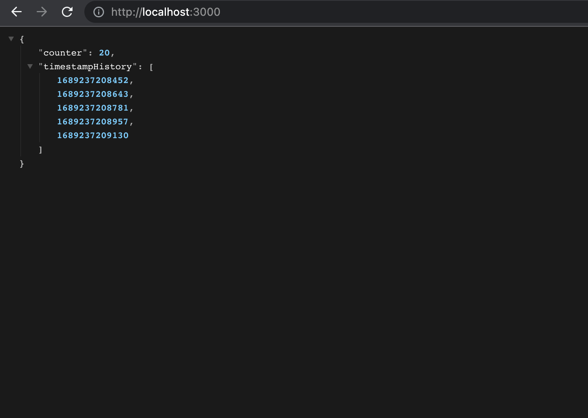

# Counter App
The Counter App is a simple web application that allows users to increment a counter value. The counter value is updated in real-time using WebSocket communication.

## Usage

To use the Counter App, follow the steps below:

1. Clone the repository:

   ```bash
   git clone https://github.com/khatiazitanishvili/counter-app.git

# Installation
    npm install


# Server
You can start projekt either via VSCode or more simply via the command line with `npm start`.


## Start Server

In the project server directory, you can run:

### `npm start`

- The server also provides an API endpoint at http://localhost:3000 where you can access the current counter value and the timestamp history.
- To view the timestamp history, you can navigate to http://localhost:3000 in your web browser.



## Start Client
In the project server directory, you can run:

### `npm run serve`

- Open your web browser and navigate to http://localhost:8080.
- The web application will display the current counter value.
- Click the "Increment" button to increase the counter.


